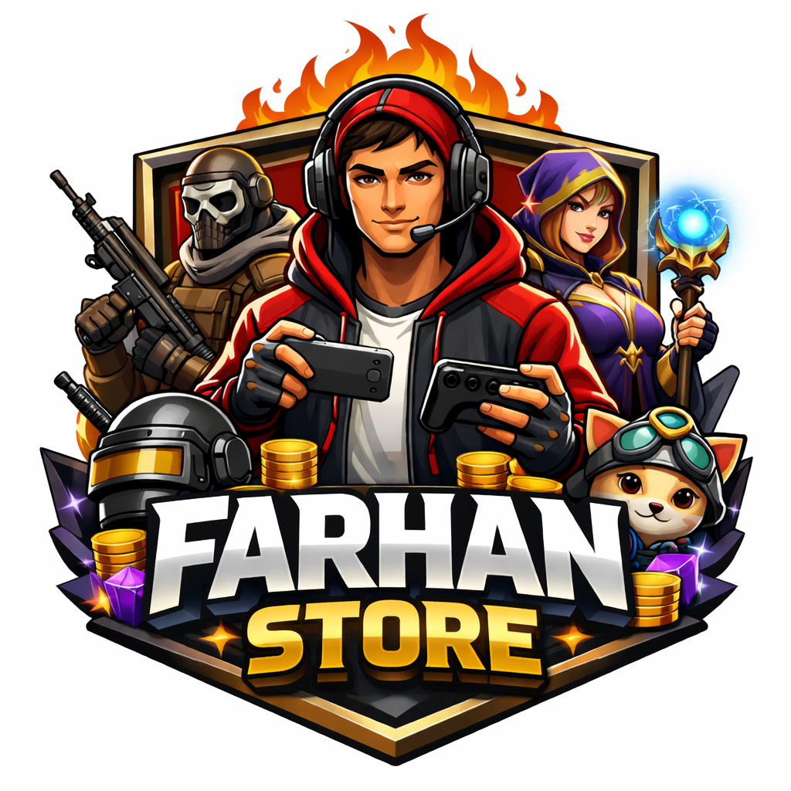

<html lang="id">
<head>
  <meta charset="UTF-8" />
  <meta name="viewport" content="width=device-width, initial-scale=1.0"/>
  <title>RHN Capital</title>

  <link href="https://fonts.googleapis.com/css2?family=Inter:wght@300;400;600;700&display=swap" rel="stylesheet">

  
</head>
<body>

<header>
  

    
FARHAN STORE

    <nav>
      <a href="#about">About</a>
      <a href="#contact">Contact</a>
    </nav>
  

</header>

<section class="hero">
  

    <h1>FARHAN STORE</h1>
    

      FARHAN STORE adalah layanan independen yang berfokus pada jasa joki game Free Fire (FF) dan Mobile Legends (ML) serta penjualan room wangi terpercaya. Farhan Store mengedepankan pelayanan yang aman, cepat, dan transparan, dengan komitmen penuh terhadap kepuasan pelanggan.
Beroperasi dengan sistem yang rapi dan bertanggung jawab, Farhan Store mengutamakan keamanan akun, ketepatan waktu, serta hasil yang sesuai kesepakatan. Dengan pendekatan profesional dan komunikasi yang jelas, Farhan Store hadir sebagai solusi bagi pemain yang ingin meningkatkan performa permainan secara efisien dan terpercaya.
Berorientasi pada kepercayaan dan konsistensi, Farhan Store siap menjadi partner andalan bagi komunitas gamer FF dan ML.
    

    
  

 
</section>

<section id="about">
  <h2>Tentang Kami</h2>
  

    Farhan Store adalah layanan joki FF & ML serta penjual room wangi yang mengutamakan kepercayaan, keamanan akun, dan pelayanan cepat dengan harga yang transparan.
  

</section>

<section class="card fade-up">
  <h2>Kenapa Pilih Farhan Store?</h2>
  <ul>
    <li>✅ Akun aman & privasi terjaga</li>
    <li>⚡ Proses cepat & transparan</li>
    <li>🤝 Komunikasi jelas via WhatsApp</li>
    <li>🎮 Fokus FF & ML (bukan abal-abal)</li>
  </ul>
</section>

  <h2>FARHAN STORE</h2>
  

    

      
      <h3>FARHAN STORE</h3>
     
    

  

      

    
      

<section id="contact">
  <h2>Kontak</h2>
  

    <a href="https://wa.me/6285717426626" target="_blank">WhatsApp</a>
    <a href="https://instagram.com/huyrehan" target="_blank">Instagram</a>
    <a href="https://www.tiktok.com/@FARHAN STORE" target="_blank">Tiktok</a>
  

</section>
<button onclick="window.open('https://wa.me/6285717426626?text=Halo%20FARHAN%20STORE,%20saya%20ingin%20melakukan%20pembayaran.','_blank')" style="
width:100%;
padding:14px;
border:none;
border-radius:12px;
background:linear-gradient(135deg,#00c853,#1de9b6);
color:#000;
font-size:16px;
font-weight:600;
cursor:pointer;
box-shadow:0 8px 20px rgba(0,200,83,.35);
">
💳 Bayar
</button>

<html lang="id">
<head>
<meta charset="UTF-8">
<meta name="viewport" content="width=device-width, initial-scale=1.0">
<title>FARHAN STORE – AKSES ROOM WANGI</title>

</head>

<body>

<!-- PAGE 1 -->

<h1>FARHAN STORE</h1>

Akses ROOM WANGI

<input id="name" placeholder="Nama Lengkap">
<input id="contact" placeholder="WhatsApp / Email">

<button class="btn-primary" onclick="nextPayment()">Lanjut Pembayaran</button>

<!-- PAGE 2 -->

<h2>Pembayaran</h2>

Bayar via QRIS (GoPay, DANA, OVO, Mobile Banking)

<button class="btn-green" onclick="openQRIS()">💳 Bayar via QRIS</button>

<button class="btn-gray" onclick="nextAccess()">Saya Sudah Bayar</button>

<!-- PAGE 3 -->

<h2>Masukkan Kode Akses</h2>
<input id="pin" placeholder="Kode Akses">

<button class="btn-primary" onclick="checkPIN()">Masuk</button>

<!-- PAGE 4 -->

<a href="ANALISA.html" class="btn">ROOM WANGI</a>

Akses ini bersifat berbayar

© 2025 RHN Capital

<!-- ===== FARHAN STORE ULTRA ANIMATION ===== -->

  <h1>FARHAN STORE</h1>

<!-- ===== END ULTRA ===== -->

<footer>
  © 2025 FARHAN STORE. JOKI FF DAN ML TERPERCAYA DAN ROOM WANGI 
</footer>

</body>
</html>
</body>
</html>
